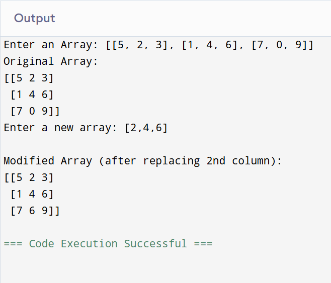

# NumPy Program - Replace the Second Column in a 2D Array

## 🎯 Aim
To write a **NumPy** program that deletes the second column from a given 2D array and inserts a new column at the same position.

## 🧠 Algorithm
1. **Import NumPy**: Start by importing the NumPy library.
2. **Get Input**: Get a 2D NumPy array and a new column (as another array) from the user.
3. **Delete Column**: Use `np.delete()` to remove the second column (index 1) from the original array.
4. **Insert Column**: Use `np.insert()` to insert the new column at the second column's original position.
5. **Display Result**: Print the updated array with the replaced column.

## 🧾 Program

```
import numpy as np
array_2d = np.array(eval(input("Enter an Array: ")))
print("Original Array:")
print(array_2d)
array_deleted = np.delete(array_2d, 1, axis=1)
new_column = np.array(eval(input("Enter a new array: ")))
array_modified = np.insert(array_deleted, 1, new_column, axis=1)
print("\nModified Array (after replacing 2nd column):")
print(array_modified)
```


## Output


## Result
Thus the program has been executed successfully.