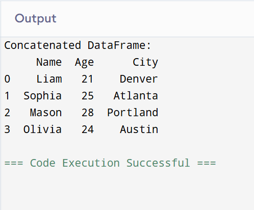

# 🧪 Pandas Program - Join Two DataFrames Along Rows

## 🎯 AIM

To write a Python program using Pandas to **join two DataFrames along rows** (row-wise concatenation) and assign all data to a new DataFrame.

---

## 🧠 ALGORITHM

1. **Import Libraries**: Import the `pandas` library.
2. **Create First DataFrame**: Use a dictionary to create `student_data1`.
3. **Create Second DataFrame**: Use another dictionary to create `student_data2`.
4. **Concatenate DataFrames**: Use `pd.concat()` with `axis=0` to concatenate both DataFrames row-wise.
5. **Display Result**: Print the new combined DataFrame.

---

## 💻 Program

```
import pandas as pd
student_data1 = {
    'Name': ['Liam', 'Sophia'],
    'Age': [21, 25],
    'City': ['Denver', 'Atlanta']
}
student_data2 = {
    'Name': ['Mason', 'Olivia'],
    'Age': [28, 24],
    'City': ['Portland', 'Austin']
}
df1 = pd.DataFrame(student_data1)
df2 = pd.DataFrame(student_data2)
result_df = pd.concat([df1, df2], axis=0, ignore_index=True)
print("Concatenated DataFrame:")
print(result_df)
```

## Output


## Result
Thus the program has been executed successfully.